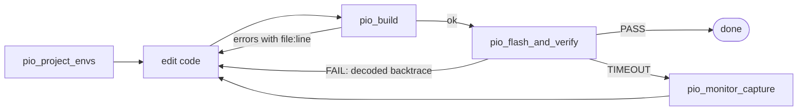

<h1 align="center">platformio.mcp</h1>

<p align="center">
  <b>Give your AI coding agent hands on real hardware.</b><br>
  An <a href="https://modelcontextprotocol.io">MCP</a> server for <a href="https://platformio.org">PlatformIO</a>: build, flash, watch serial, run tests, decode crashes, shrink firmware.
</p>

<p align="center">
  <a href="https://github.com/powerdragonfire/platformio.mcp/actions/workflows/ci.yml"></a>
  <a href="https://pypi.org/project/platformio.mcp/"></a>
  
  
  <a href="LICENSE"></a>
</p>

<p align="center">
  Python native · no Node · one line to install · works with Claude Code, Claude Desktop, Cursor, Codex, Windsurf, Cline
</p>

---

## ⚡ 60-second install

You need [uv](https://docs.astral.sh/uv/) (`curl -LsSf https://astral.sh/uv/install.sh | sh`). Then:

```bash
uvx platformio.mcp install --claude-code      # or --cursor  --claude-desktop  --codex  --windsurf
```

No PlatformIO on this machine? Add `--with-platformio` and the server brings PlatformIO Core along.

<details>
<summary><b>Any other MCP client</b> (Cline, Zed, Continue, ...)</summary>

```bash
uvx platformio.mcp install --print
```

```json
{ "mcpServers": { "platformio": { "command": "uvx", "args": ["platformio.mcp"] } } }
```

Use `"args": ["platformio.mcp[platformio]"]` to bundle PlatformIO Core.
</details>

<details>
<summary><b>Already have PlatformIO?</b></summary>

The server finds `platformio` / `pio` on your PATH or in `~/.platformio/penv`. Override with `PLATFORMIO_MCP_PIO=/path/to/pio`. Run `uvx platformio.mcp doctor` to see what the agent will see.
</details>

## 🎬 What it looks like

> **You:** flash the `view` env and make sure it boots.
>
> **Agent** → `pio_flash_and_verify(env="view", expect="setup done")`
>
> ```
> FAIL: firmware flashed but the boot log matched the failure pattern:
> 'Guru Meditation Error: Core 1 panic'ed (LoadProhibited)'.
> Cause: LoadProhibited. 3/3 addresses resolved:
>   DisplayTask::run() (display_task.cpp:22) <- DisplayTask::run() (display_task.cpp:23) <- vPortTaskWrapper (port.c:143)
> ```
>
> **Agent:** null pointer on line 22 of `display_task.cpp`, `tft_` is used before `begin()`. Fixing, rebuilding, flashing again.
>
> ```
> PASS: flashed env view in 14.2s and saw 'setup done' on /dev/cu.usbserial-0001 after 2.1s of boot output.
> ```

No 40 KB build logs in the context window. No human reading the serial monitor. The agent gets a verdict, a file and a line.

## 🔁 The loop the agent runs



## 🧰 The 29 tools

<table>
<tr><th>Group</th><th>Tools</th><th>What the agent gets back</th></tr>
<tr>
<td>🔍 <b>Discover</b></td>
<td><code>pio_system_info</code> · <code>pio_list_boards</code> · <code>pio_board_info</code> · <code>pio_list_devices</code></td>
<td>PlatformIO version and policy; ~1,700 boards with MCU, clock, RAM and flash sizes; serial ports with the likely dev boards flagged</td>
</tr>
<tr>
<td>📁 <b>Project</b></td>
<td><code>pio_project_init</code> · <code>pio_project_envs</code> · <code>pio_project_metadata</code></td>
<td>A real <code>pio project init</code> (never a hand-written ini); every env with board, framework, monitor and upload settings; defines and include paths</td>
</tr>
<tr>
<td>🔨 <b>Build &amp; flash</b></td>
<td><code>pio_build</code> · <code>pio_upload</code> · <code>pio_clean</code> · <code>pio_list_targets</code> · <code>pio_run_target</code></td>
<td>Status, parsed errors and warnings (file, line, column), RAM/Flash %, last 40 lines, full log path. Extra targets like <code>buildfs</code>, <code>erase</code></td>
</tr>
<tr>
<td>📟 <b>Serial</b></td>
<td><code>pio_monitor_start</code> / <code>read</code> / <code>write</code> / <code>stop</code> / <code>list</code> · <code>pio_monitor_capture</code></td>
<td>Background sessions with a ring buffer, cursor reads, and <code>wait_for</code> regex; or a one-shot capture with nothing to manage</td>
</tr>
<tr>
<td>✅ <b>Verify</b></td>
<td><code>pio_test</code> · <code>pio_check</code></td>
<td>Unity tests with per-case pass/fail and messages; cppcheck / clang-tidy defects by severity with CWE ids</td>
</tr>
<tr>
<td>📦 <b>Packages</b></td>
<td><code>pio_pkg_search</code> / <code>install</code> / <code>uninstall</code> / <code>list</code> / <code>outdated</code> / <code>update</code></td>
<td>Registry search and dependency changes that keep <code>platformio.ini</code> in sync</td>
</tr>
<tr>
<td>🧠 <b>Analyse</b></td>
<td><code>pio_flash_and_verify</code> · <code>pio_decode_backtrace</code> · <code>pio_size_report</code></td>
<td>Hardware-in-the-loop pass/fail; crash dumps resolved to file:line; where every byte of flash and RAM goes</td>
</tr>
</table>

Every tool returns `ok`, a one-paragraph `summary` written for the model, structured fields, and a `log_path` to the full output. Long output stays on disk under `~/.platformio-mcp/logs` (newest 200 files kept).

### The three tools that go beyond the CLI

| | What it does | Under the hood |
|---|---|---|
| 🚀 **`pio_flash_and_verify`** | Flash, open the port, read until `expect` matches (**pass**), a crash signature matches (**fail**, auto-decoded), or the timeout passes (**timeout**) | `pio run -t upload` + pyserial; `fail_on` defaults to Guru Meditation, HardFault, `abort()`, `assert failed`, watchdog, brownout, heap corruption |
| 🩺 **`pio_decode_backtrace`** | Turn an ESP32 `Backtrace: 0x400d...` dump or a Cortex-M `pc`/`lr` dump into function, file, line, inlined frames, cause, reset reason | Toolchain located from `pio project metadata`, then `<target>-addr2line -pfiaC` on `firmware.elf`; fixes Xtensa `A0` window bits |
| 📊 **`pio_size_report`** | Why is the firmware this big? Flash/RAM %, loaded sections, biggest symbols with `file:line`, per-file totals, regex `filter` | `pio run -t checkprogsize` (partition-aware) + GNU `size -A` + `nm -S -C -l --size-sort` |

## 🔒 Safety policy

Set `PLATFORMIO_MCP_POLICY` in the server's `env`, or pass `--policy` to `install`:

| Policy | Can build | Can flash / erase / write serial | Use it for |
|---|:-:|:-:|---|
| `full` (default) | ✅ | ✅ | Your own bench |
| `build_only` | ✅ | ❌ | Shared labs, CI, "look but don't touch" |
| `read_only` | ❌ | ❌ | Code review, onboarding, untrusted prompts |

MCP clients also prompt before each tool call. Policies are the second layer, not the only one.

## ⚙️ Settings

| Variable | Purpose | Default |
|---|---|---|
| `PLATFORMIO_MCP_POLICY` | `full`, `build_only`, `read_only` | `full` |
| `PLATFORMIO_MCP_PROJECT_DIR` | Project used when a tool is called without `project_dir` | server's cwd |
| `PLATFORMIO_MCP_PIO` | Explicit path to the `pio` executable | auto-detect |
| `PLATFORMIO_MCP_LOG_DIR` | Where full command logs go | `~/.platformio-mcp/logs` |
| `PLATFORMIO_MCP_MAX_LOGS` | How many log files to keep | `200` |

## 📝 Serial monitor notes

Sessions talk to the port with pyserial directly, because PlatformIO's own monitor needs an interactive terminal. PlatformIO monitor filters such as `esp32_exception_decoder` therefore do not apply; `pio_decode_backtrace` does that job. Baud and port default from `monitor_speed` / `monitor_port` in `platformio.ini` when `project_dir` is passed, otherwise the single detected dev board at 115200. Opening the port resets most dev boards, which is why `pio_flash_and_verify` sees the boot log from the top.

## 🛠️ Development

```bash
git clone https://github.com/powerdragonfire/platformio.mcp && cd platformio.mcp
uv sync
uv run pytest                    # unit tests, no hardware or network
uv run pytest -m integration     # builds the bundled native fixture with your PlatformIO
uv run platformio-mcp doctor     # what the agent's pio_system_info sees
npx @modelcontextprotocol/inspector uv run platformio-mcp   # poke tools interactively
```

To use your checkout in Claude Code instead of the PyPI release:

```bash
claude mcp add platformio -- uv run --directory /path/to/platformio.mcp platformio-mcp
```

Changes are tracked in [CHANGELOG.md](CHANGELOG.md).

## 🤝 Prior art

[jl-codes/platformio-mcp](https://github.com/jl-codes/platformio-mcp) is a TypeScript server with the same goal, a web dashboard, and a GPIO pin audit. This project exists for people who want a Python-only install through `uvx`, one that can bundle PlatformIO itself, and crash decoding and size budgeting built in.

## License

MIT

<!-- mcp-name: io.github.powerdragonfire/platformio.mcp -->
